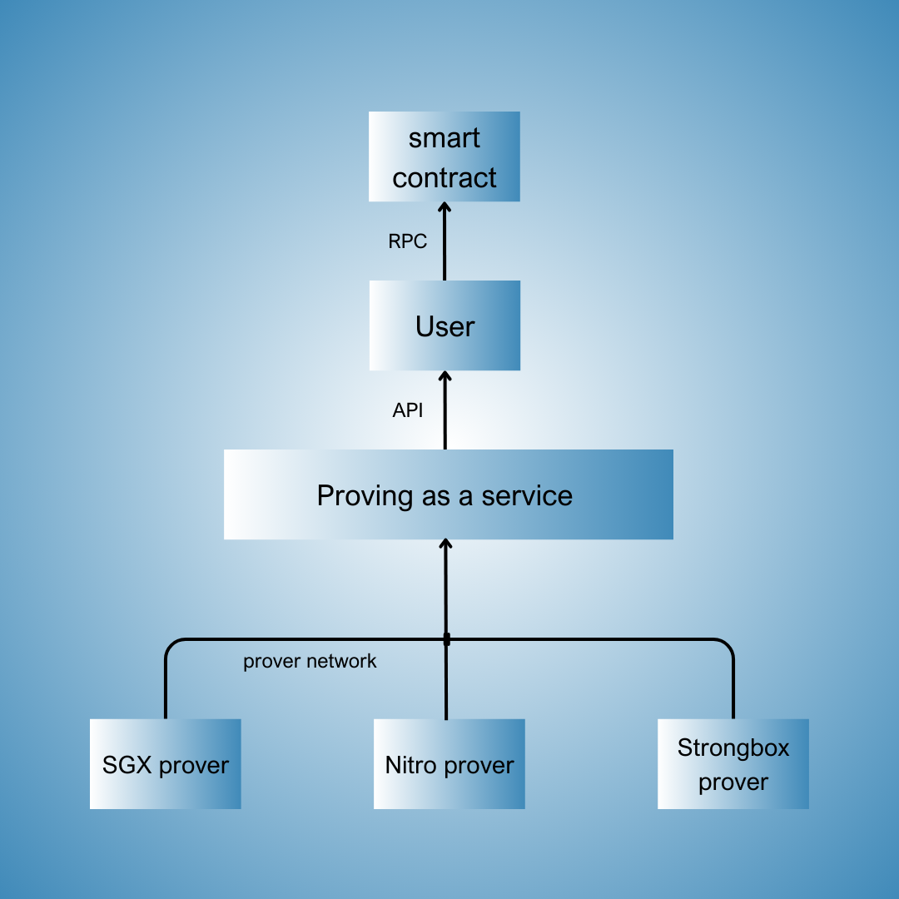

# Welcome to the Proofcast Documentation

Visit our [website](https://www.proofcast.xyz/). Stay updated with the latest news by following us on [X](https://www.x.com/proofcastlabs). Builders, developers, and curious minds are welcome to join our [Telegram group](https://t.me/proofcast_builder) to chat with the team.

## [Overview](https://proofcastlabs.github.io/docs/Introduction.html#overview)

Proofcast wants to democratize access to cryptographic proofs backed by Trusted Execution Environments (TEE) with the first “proving-as-a-service” solution based on trusted hardware.  

### **What are TEEs?**

TEEs are isolated execution environments within the main processor, where both code and data are protected at the hardware level. The secure enclave ensures:

1. **Confidentiality**: code and data within the TEE are isolated and cannot be accessed by any unauthorized components, including the operating system and hypervisor.
2. **Integrity**: the code and data within the TEE are shielded from tampering, even by privileged software or physical attacks on the hardware.
3. **Hardware Attestation**: TEEs support cryptographic attestation, enabling the generation of verifiable proofs that the code executed inside the TEE is authentic and has not been altered.

### **Why it matters?**

Blockchains like Ethereum are evolving into a modular stack, where multiple specialized layers (settlement, execution, consensus, data availability) outsource functions and exchange data with each other.

In particular, the decoupling between settlement and execution layers has given rise to the sector of **coprocessors**, execution layers designed to handle heavier computation more cheaply and efficiently.

However, they must commit to settlement layers via cryptographic proofs to ensure security and integrity across the system.

### **The limit of zk-proofs**

The ascent of zero-knowledge proofs has been accelerated by the introduction of zkVMs: a revolution in abstraction and user experience.

It has enabled teams to generate zk-proofs directly from a Rust program, eliminating the need to design custom circuits and reducing overhead for developers.

Complexity was reduced, effectively democratizing access to zk-technology.

We believe the same should happen with Trusted Execution Environments. 

The next generation of on-chain applications can only be enabled by co-processing power backed by TEEs. 

Use cases like dePIN, decentralized AI (dAI), on-chain gaming, and data-rich applications involving heavy computation can be offloaded off-chain in a secure way.

For this type of application—representing the future of real-world utility—zk will never be a viable option.

However, teams today need to secure computation, amidst fragmentation between specific TEEs (Intel SGX, AWS Nitro, etc.) and different proving networks.

There is no control board or simple interface.

### **We believe the same transformation should occur with Trusted Execution Environments (TEEs).**

The next generation of on-chain applications can only be unlocked by leveraging co-processing power secured by TEEs.

Use cases such as dePIN, decentralized AI, on-chain gaming—data-rich applications with heavy computation that can be efficiently offloaded off-chain in a secure and reliable manner.

For these types of applications—representing the future of real-world utility—zk-proofs will never be a fully viable solution.

However, teams today face challenges in securing TEEs computation, due to fragmentation among various TEEs (Intel SGX, AWS Nitro, etc.) and disparate proving networks without a unified control board and a simple interface, tailored to the specific needs. 

### **The future of TEEs: “proving-as-a-service”**

Proofcast wants to become the “proving-as-a-service” standard for TEEs.

We bet on giving developers better accessibility and UX by leveraging:

- **Abstraction**: working with TEEs should be as simple as pressing a button and running your code;
- **Selection**: our stack aims at supporting all types of devices (Intel, AWS, Android, etc.);
- **Customization**: no lock-in network or standalone product, but a suite tailored to specific needs.

Our go-to-market is a suite of products that currently range from the first general-purpose TEE-VM, to event attestator (cross-chain) and light clients.
